# MyPA — Complete Architecture Deep Dive (Updated)

## High-Level Architecture

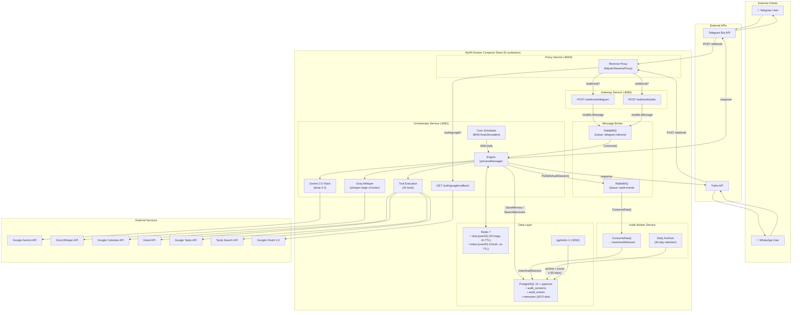

---

## What Changed Since Last Analysis

> [!IMPORTANT]
> ### Summary of Changes
> 1. **New Audit Worker service** with daily archiver (30-day retention → JSONL export → DB prune)
> 2. **Restructured audit schema** — `AuditSession` + `AuditEvent` replacing flat `AuditLog`
> 3. **Generic broker** — `Publish(ctx, v any)` and `ConsumeRaw(func([]byte))` methods
> 4. **Unified Dockerfile** — single multi-target file with distroless runtime images
> 5. **New `EventPublisher` port interface** in orchestrator
> 6. **Healthcheck `start_period`** added to all infra containers

| Area | Before | After |
|---|---|---|
| **Audit model** | Flat `AuditLog` (user_message, llm_response, action_taken) | **`AuditSession`** (session-level: UUID, timing, tokens, status) + **`AuditEvent`** (span-level: event_type, payloads as JSONB, per-span timing & tokens) |
| **Audit persistence** | Orchestrator `defer` → direct DB write | Orchestrator → RabbitMQ `audit.events` → **Audit Worker** → DB |
| **Audit retention** | None | **30-day retention** — daily archiver exports to JSONL, prunes from DB |
| **Broker API** | `Publish(ctx, models.Message)`, `Consume(func(models.Message))` | **`Publish(ctx, v any)`**, `Consume(func(models.Message))`, **`ConsumeRaw(func([]byte))`** |
| **DB methods** | `LogInteraction(AuditLog)`, `GetLastAuditLogForUser()` | **`InsertAuditSession(AuditSession)`**, **`InsertAuditEvent(AuditEvent)`**, **`GetLastAuditSessionForUser()`** |
| **Port interfaces** | 9 interfaces | **10 interfaces** (added `EventPublisher`) |
| **Dockerfiles** | 3 separate files | **1 unified multi-target** with `gcr.io/distroless/static-debian12` runtimes |
| **Docker containers** | 7 | **8** (added audit-worker) |
| **Healthchecks** | No `start_period` | All infra: `start_period` (RabbitMQ 10s, Redis 5s, Postgres 10s) |

### What Did NOT Change
Gateway, Proxy, LLM client, tool declarations (20 tools), Calendar, Gmail, Tasks, Tavily, Scraper, Audio, Telegram, Twilio, Redis state store, PostgreSQL Memory schema, Scheduler, Markdown converters, Config structure.

---

## Infrastructure: 8-Container Docker Stack

| Container | Dockerfile Target | Runtime | Port | Role |
|---|---|---|---|---|
| **proxy** | `proxy` | `distroless/static-debian12` | `:8000` | Reverse proxy: webhooks → Gateway, OAuth → Orchestrator |
| **gateway** | `gateway` | `distroless/static-debian12` | `:8080` | Telegram & Twilio webhook ingestion → RabbitMQ |
| **orchestrator** | `orchestrator` | `distroless/static-debian12` | `:8081` | Brain: LLM reasoning, tool execution, audit publishing |
| **audit-worker** | `audit-worker` | `distroless/static-debian12` | — | Audit log persistence + 30-day retention archiver |
| **rabbitmq** | (image) | `rabbitmq:3.13-management-alpine` | `:5672`/`:15672` | 2 durable queues: `telegram.inbound` + `audit.events` |
| **redis** | (image) | `redis:7-alpine` | `:6379` | Session state + OAuth tokens |
| **postgres** | (image) | `pgvector/pgvector:pg15` | `:5432` | Audit sessions/events + semantic memory |
| **pgadmin** | (image) | `dpage/pgadmin4` | `:5050` | Database admin UI |

### Unified Dockerfile

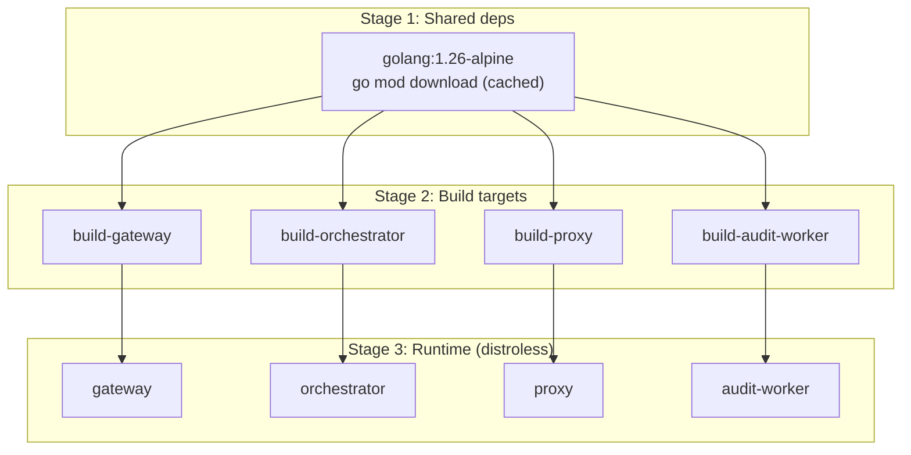

- Shared `deps` stage for `go mod download`
- Granular `COPY` per service (only `internal/`, `config/`, `cmd/<service>/`)
- BuildKit cache mounts for `/go/pkg/mod` and `/root/.cache/go-build`
- `ldflags='-w -s'` for stripped binaries
- `gcr.io/distroless/static-debian12` runtime (no shell, minimal attack surface)

---

## RabbitMQ: Two Queue Topology

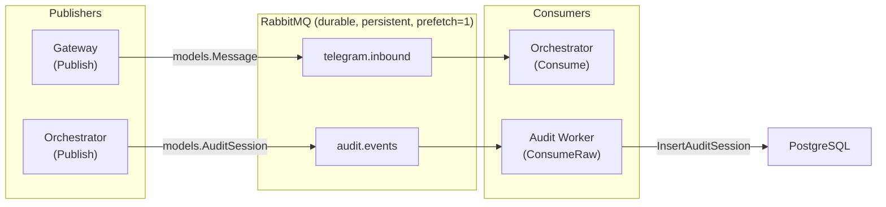

| Queue | Payload | Publisher | Consumer | Method | ACK Strategy |
|---|---|---|---|---|---|
| `telegram.inbound` | `models.Message` | Gateway | Orchestrator | `Consume(func(Message))` | ACK/NACK+requeue/Reject |
| `audit.events` | `models.AuditSession` | Orchestrator | Audit Worker | `ConsumeRaw(func([]byte))` | ACK on success, return `nil` on bad JSON (discard), return `error` on DB failure (requeue) |

The broker's `Publish(ctx, v any)` now accepts any JSON-serializable type, enabling reuse for both message types.

---

## Data Models

### Audit Schema (NEW — replaces flat AuditLog)

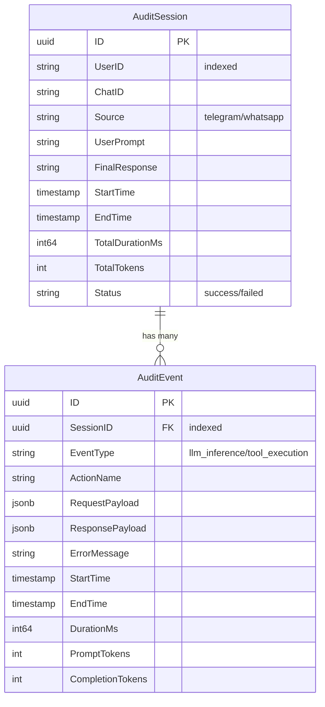

**Key improvements over flat `AuditLog`:**
- **Session-level** tracking: UUID session ID, total duration, total tokens, status
- **Event/span-level** granularity: individual LLM inferences and tool executions tracked separately
- **JSONB payloads**: full request/response data stored for debugging
- **Per-span token counts**: prompt and completion tokens tracked per event

### Other Models (unchanged)

| Model | Table | Purpose |
|---|---|---|
| `Message` | (RabbitMQ only) | Normalized cross-platform message |
| `ChatMessage` | (Redis only) | Conversation history turn |
| `Memory` | `memories` | Semantic facts with 3072-dim pgvector embeddings |
| `CalendarEvent` | (API only) | Google Calendar event structure |

---

## The Audit Worker (NEW)

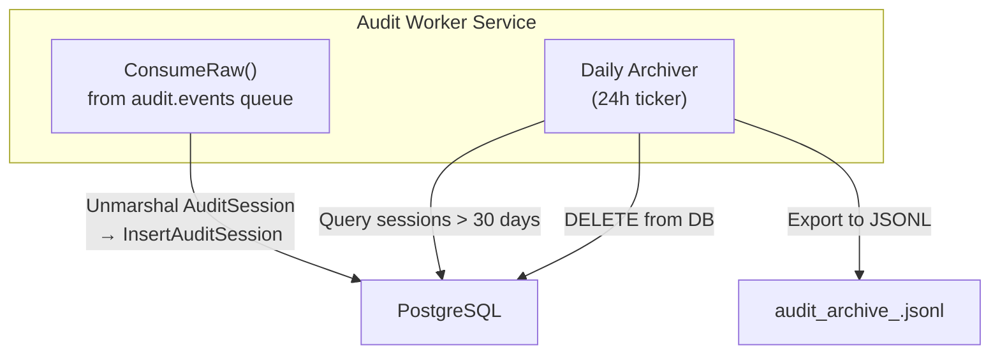

**Two concurrent goroutines:**

1. **Consumer**: Reads from `audit.events` queue, deserializes `AuditSession`, persists to PostgreSQL. Poison messages (bad JSON) are discarded with `return nil`. DB errors cause requeue via `return error`.

2. **Daily Archiver** (`startArchiver`):
   - Runs on a `24h` ticker
   - Queries audit sessions older than 30 days
   - Exports them to timestamped JSONL files (`audit_archive_<unix_ts>.jsonl`)
   - Deletes archived records from PostgreSQL
   - Provides automatic data retention management

---

## All Flows

### Inbound (User-Initiated)
| # | Flow | Source | Trigger |
|---|---|---|---|
| 1 | **Text Message** | Telegram or WhatsApp | User sends text |
| 2 | **Voice Message** | Telegram or WhatsApp | User sends voice note |
| 3 | **`/connect` Command** | Telegram or WhatsApp | User types `/connect` |

### System-Initiated
| # | Flow | Trigger |
|---|---|---|
| 4 | **Morning Brief** | Cron at 8:00 AM Israel time |

---

## Flow 1: Text Message

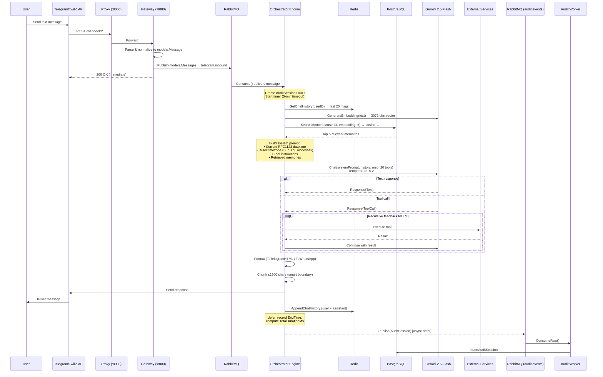

### Key Details
- Gateway responds instantly — no AI at the Gateway
- Redis: sliding 20-message window (RPUSH + LTRIM + EXPIRE 1h)
- Every message embedded via `gemini-embedding-001`, top 5 memories recalled via pgvector cosine distance
- LLM at temperature 0.2 for reliable tool calls
- **Session-based telemetry**: UUID session ID created at start, timing recorded, published as `AuditSession` on completion
- Poison pill defense: errors caught, user notified, message ACKed

---

## Flow 2: Voice / Audio Message

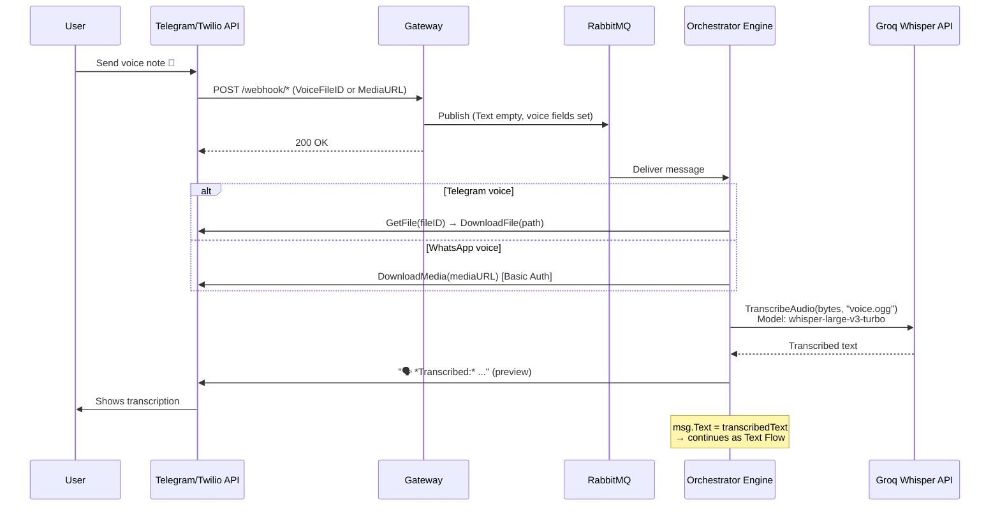

- Audio download + transcription in Orchestrator (not Gateway)
- Groq Whisper `whisper-large-v3-turbo` — auto language detection
- User gets real-time transcription preview

---

## Flow 3: `/connect` Command (Google OAuth)

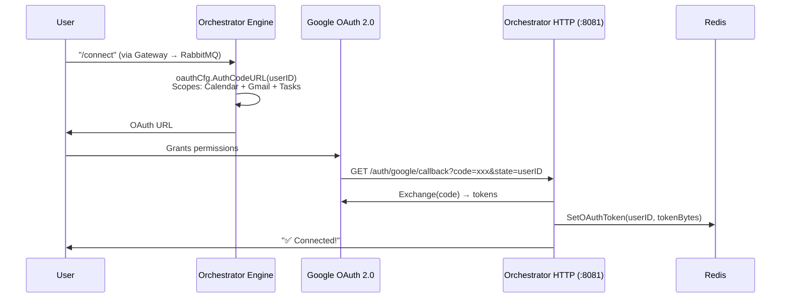

- Single OAuth flow for Calendar + Gmail + Tasks
- Tokens in Redis without expiration, auto-refreshed

---

## Flow 4: Morning Brief (Scheduled)

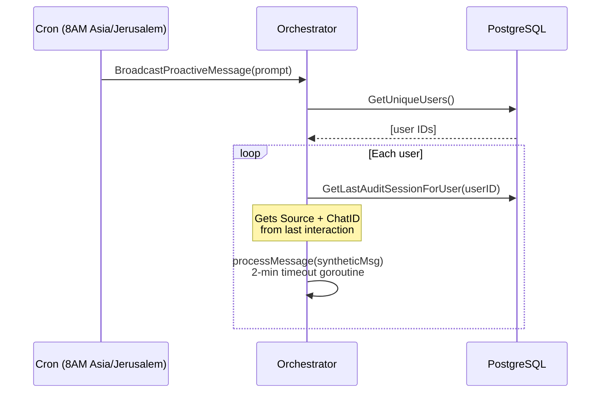

- Multi-tenant: broadcasts to all known users
- Platform-aware: sends on each user's last-used platform
- Each user in a separate goroutine (2-min timeout)

---

## Tool Catalog (20 Tools)

#### Calendar (4)
| Tool | Action |
|---|---|
| `create_calendar_event` | Create with title, start/end (ISO 8601), timezone, description, recurrence |
| `list_calendar_events` | List in date range with query |
| `update_calendar_event` | Partial update via Patch API |
| `delete_calendar_event` | Delete by ID |

#### Email (8)
| Tool | Action |
|---|---|
| `search_emails` | Gmail query syntax search |
| `read_email` | Full body (recursive MIME decode) |
| `draft_email_reply` | Draft with proper threading headers |
| `archive_emails` | Remove INBOX label (batch) |
| `soft_delete_emails` | Move to Trash (batch) |
| `list_email_labels` | Name → ID map |
| `apply_email_labels` | Apply label (batch) |
| `create_email_label` | Create new label |

#### Tasks (6)
| Tool | Action |
|---|---|
| `list_task_lists` | List all task lists |
| `create_task_list` | Create new list |
| `list_tasks` | Pending tasks (default `@default`) |
| `create_task` | Create with title, notes, due |
| `complete_task` | Mark completed |
| `delete_task` | Delete permanently |

#### Web (2)
| Tool | Action |
|---|---|
| `search_web` | Tavily — AI answer + top 3. Progress: "🔍 Searching..." |
| `fetch_webpage` | Readability → Markdown, 20k limit. Progress: "📖 Reading..." |

#### Memory (1)
| Tool | Action |
|---|---|
| `remember_fact` | Embed via gemini-embedding-001 → pgvector |

### Recursive Agent Loop

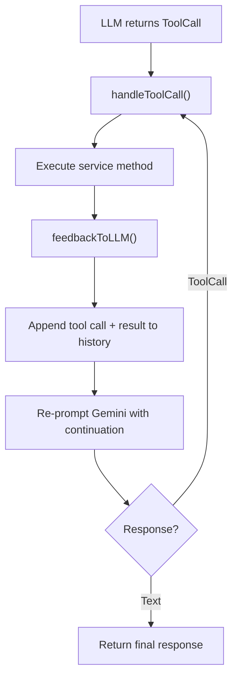

No hard iteration limit — recurses until LLM produces final text. Enables multi-step chains (e.g., search emails → read → create task → draft reply → summarize).

---

## Dual-Layer Persistence

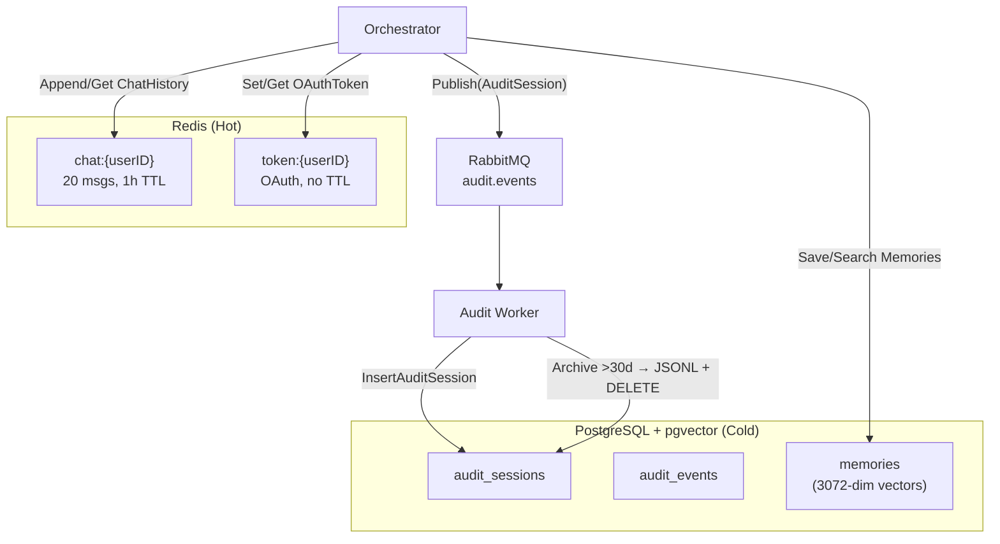

| Store | Data | Writer | Retention |
|---|---|---|---|
| **Redis** `chat:{userID}` | Last 20 turns | Orchestrator | 1 hour TTL |
| **Redis** `token:{userID}` | Google OAuth tokens | Orchestrator (OAuth callback) | Permanent |
| **PostgreSQL** `audit_sessions` | Session-level interaction logs | Audit Worker | **30 days** (archived to JSONL) |
| **PostgreSQL** `audit_events` | Per-span action traces | Audit Worker | Follows sessions |
| **PostgreSQL** `memories` | Semantic facts (3072-dim vectors) | Orchestrator (`remember_fact`) | Permanent |

---

## Clean Architecture: Port Interfaces

10 interfaces in [`ports.go`](file:///D:/MyPA/internal/orchestrator/ports.go):

| Interface | Methods |
|---|---|
| `TelegramClient` | `SendMessage`, `GetFile`, `DownloadFile` |
| `TwilioClient` | `SendMessage`, `DownloadMedia` |
| `AudioClient` | `TranscribeAudio` |
| `LLMClient` | `Chat`, `GenerateEmbedding` |
| `CalendarClient` | `CreateEvent`, `ListEvents`, `UpdateEvent`, `DeleteEvent` |
| `GmailClient` | `SearchEmails`, `ReadEmail`, `DraftReply`, `ArchiveEmail`, `SoftDeleteEmail`, `ListLabels`, `ApplyLabel`, `CreateLabel` |
| `TasksClient` | `ListTaskLists`, `CreateTaskList`, `ListTasks`, `CreateTask`, `CompleteTask`, `DeleteTask` |
| `DBClient` | `SaveMemory`, `SearchMemories`, `GetUniqueUsers`, `GetLastAuditSessionForUser` |
| **`EventPublisher`** | **`Publish(ctx, v any)`** ← NEW |
| `TavilyClient` | `Search` |

Unit tested with GoMock-generated mocks.

---

## Key Architecture Decisions

| Decision | Detail |
|---|---|
| **Async message processing** | Gateway responds instantly, offloads to RabbitMQ. Orchestrator has 5-min timeout. |
| **Gateway is dumb** | No AI, no downloads, no transcription. Only normalize and publish. |
| **RabbitMQ with manual ACK** | Durable queues, prefetch=1, manual ACK/NACK/Reject. Poison pill rejection. |
| **Decoupled audit pipeline** | Orchestrator → RabbitMQ `audit.events` → Audit Worker → PostgreSQL. Zero DB latency on request path. |
| **Structured audit telemetry** | Session + Event model with UUIDs, timing, token counts, JSONB payloads. |
| **30-day audit retention** | Daily archiver exports old sessions to JSONL, prunes from DB. |
| **Dual AI providers** | Gemini 2.5 Flash (reasoning), Groq Whisper (transcription), Gemini Embedding (memory). |
| **Semantic long-term memory** | pgvector 3072-dim cosine search on every message. `remember_fact` stores new facts. |
| **Redis for session state** | Sliding 20-msg window, 1h TTL. OAuth tokens permanent. |
| **Multi-tenant OAuth** | Per-user Google tokens in Redis. Calendar + Gmail + Tasks in one flow. Auto-refresh. |
| **Dual inbound channels** | Telegram + WhatsApp normalized to `models.Message`. |
| **Recursive tool loop** | No hard limit — recurses until LLM produces final text. |
| **Unified Dockerfile** | Multi-target with BuildKit caching. Distroless runtime images. Granular COPY. |
| **Generic broker** | `Publish(ctx, v any)` — reusable for any JSON-serializable payload type. |

---

## Complete End-to-End Flow

```
[User sends message on Telegram or WhatsApp]
        │
        ▼
[Platform API → Proxy (:8000) → Gateway (:8080)]
        │
        ▼
[Gateway: Normalize → Publish(models.Message) → RabbitMQ "telegram.inbound"]
        │
        ▼
[Orchestrator Engine: processMessage() — 5min timeout]
        │
        ├── [Create AuditSession UUID, start timer]
        │
        ├── [/connect?] → Return Google OAuth URL & exit
        │
        ├── [Voice?] → Download → Groq Whisper → preview → replace Text
        │
        ├── [Redis] → GetChatHistory (last 20)
        ├── [Gemini] → GenerateEmbedding (3072 dims)
        ├── [PostgreSQL] → SearchMemories (cosine ⇔, top 5)
        │
        ├── [Build system prompt] → datetime, timezone, tools, memories
        │
        ├── [Gemini LLM] → Chat @ temp 0.2, 20 tools
        │       ├── [Text] → Format & send
        │       └── [ToolCall] → Execute → feedbackToLLM → recurse
        │
        ├── [Format] → ToTelegramHTML() or ToWhatsApp()
        ├── [Chunk ≤1500] → smart boundary splitting
        ├── [Send] → Telegram/Twilio API
        ├── [Redis] → AppendChatHistory (user + assistant)
        │
        └── [defer] → Record EndTime, compute duration
                    → Publish(AuditSession) → RabbitMQ "audit.events"
                                                    │
                                                    ▼
                                          [Audit Worker]
                                          ├── InsertAuditSession → PostgreSQL
                                          └── Daily: Archive >30d → JSONL + DELETE
```
